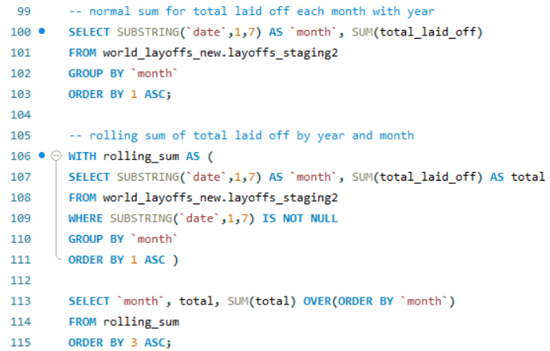

# 📊 SQL Exploratory Data Analysis (EDA) – Layoffs Dataset

## 📌 Project Overview

This project performs exploratory data analysis on a cleaned global layoffs dataset using SQL. It leverages aggregate functions, window functions, and time series analysis to uncover key patterns and trends related to layoffs across companies, industries, countries, and over time.

The analysis aims to provide insights into the scale and dynamics of layoffs, identify companies with the most layoffs, and observe temporal trends to support business decision-making.

---

## 🛠 Tools Used

- **MySQL**: Relational database used to query and analyze the dataset.
- **MySQL Workbench**: IDE used to write and execute SQL queries.

---

## 🧠 SQL Concepts & Techniques Applied

This project leveraged a variety of SQL features and methodologies to explore and analyze the layoffs dataset effectively:

1. **Aggregation Functions (`SUM()`, `MAX()`)**  
   Used to calculate totals and maximum values for layoffs and percentages, providing summarized insights across companies, industries, countries, and time periods.

2. **Filtering and Sorting**  
   Applied conditions and ordering to focus analyses on specific subsets, such as companies with full layoffs, and to prioritize results for clearer interpretation.

3. **Grouping (`GROUP BY`)**  
   Enabled multi-dimensional aggregation of data by key categorical fields like company, industry, country, and funding stage, supporting detailed segment-level analysis.

4. **Time Series Analysis**  
   Explored temporal trends in layoffs by grouping data by date, month, and year to identify patterns over time and the impact of external events.

5. **Window Functions (`SUM() OVER()`, `DENSE_RANK()`)**  
   Used to calculate rolling cumulative sums and to rank companies annually by layoffs, providing insights into progression and relative impact.

  

7. **Common Table Expressions (CTEs)**  
   Utilized to structure complex queries into readable, manageable blocks, particularly helpful for calculating rolling sums and ranking results.

  

---

## 📂 Dataset Description

The analysis uses the cleaned layoffs dataset with the following key columns:

- `company`
- `location`
- `industry`
- `total_laid_off`
- `percentage_laid_off`
- `date`
- `stage`
- `country`
- `funds_raised_millions`

---

## ✅ Outcome

- Gained detailed insights into layoffs distribution and temporal trends.
- Highlighted key companies, industries, and countries most affected.
- Prepared data summaries to support further visualization and modeling.

---

## 📁 Files Included

- `Exploratory_Data.sql`: Complete SQL script with exploratory queries.
- `README.md`: This documentation file.
- `final_layoffs_dataset.xlsx` : Used dataset.

---

## 📬 Contact

**Manal Mosharaf**  
_Data Analyst | SQL Enthusiast_  
📧 [mosharafmanal@gmail.com]  
🔗 [LinkedIn Profile or Portfolio Website]
